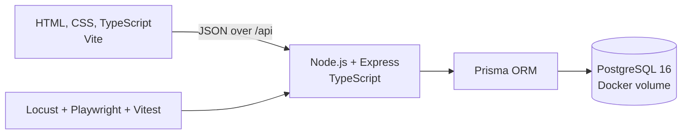

# CineNest — Movie Café Booking System

CineNest is a complete web application for operating a private movie café. Customers can reserve a room, choose a movie or decide at the café, pre-order food and drinks, and track their bookings. Staff manage the daily room schedule, walk-in customers, movie preparation, food orders, check-in, exceptions, and checkout. Managers maintain rooms, movies, menu items, employee accounts, approvals, and business reports.

CineNest was developed by a six-member team of final-year Information Technology students for a Web Development capstone. It implements the standard product requirements and adds database-level concurrency protection, idempotent writes, performance testing, a large movie catalogue, and complete customer-to-staff browser tests.

## Product capabilities

### Customer

- Register, sign in, and maintain a server-side session.
- Search available rooms by date, start time, two- or three-hour session, and guest count.
- Review room capacity, amenities, hourly price, session total, and images.
- Select a movie that fits the session or choose the movie at the café.
- Pre-order food and drinks using trusted prices from the server.
- Confirm a four-step booking, view upcoming and past bookings, and cancel within policy.

### Staff

- View the daily room schedule with booking, cleaning, and overdue states.
- Create walk-in bookings and search by booking code or phone number.
- Check customers in, mark no-shows, record forgotten check-ins, or end a session early with a reason.
- Prepare movies, process food orders, calculate invoices, request adjustments, and collect payment.

### Manager

- Manage rooms, room images, amenities, prices, movies, menu items, and employee accounts.
- Approve or reject discounts and waivers.
- Review booking, revenue, room-hour, unpaid, and waived reports.

## Architecture and stack



| Layer                | Technology                                                                     |
| -------------------- | ------------------------------------------------------------------------------ |
| Frontend             | HTML5, CSS3, TypeScript, Vite multi-page application                           |
| Backend              | Node.js 22+, Express 5, TypeScript                                             |
| Database             | PostgreSQL 16, Prisma 7, SQL migrations                                        |
| Authentication       | Server-side sessions stored in PostgreSQL, bcrypt password hashes, role checks |
| Testing              | Vitest, Supertest, Playwright, Locust, Lighthouse                              |
| Local infrastructure | Docker Compose for PostgreSQL                                                  |

See [Architecture](docs/ARCHITECTURE.md) for the request flow, data model, booking lifecycle, concurrency controls, and deployment model.

## Prerequisites

- Node.js 24 LTS, or Node.js 22 or later
- npm
- Docker Desktop
- Git
- Python 3.10 or later only for Locust performance tests

## Quick start

```bash
git clone https://github.com/hainguyen15022006-cmd/CineNest.git CineNest
cd CineNest
npm ci
docker compose up -d
cp backend/.env.example backend/.env
npm run db:generate
npm run db:migrate
npm run db:seed
npm run dev
```

Edit `backend/.env` and replace `SESSION_SECRET` with a long random value before using the application outside local development.

- Web application: `http://localhost:5173`
- API: `http://localhost:3000/api`
- Health check: `http://localhost:3000/api/health`

### Demo accounts

| Role     | Email                | Password      |
| -------- | -------------------- | ------------- |
| Customer | `khach@demo.local`   | `Khach#123`   |
| Staff    | `staff@demo.local`   | `Staff#1234`  |
| Manager  | `manager@demo.local` | `Manager#123` |

## Updating an existing installation

After pulling new code, apply any missing database migrations before starting the application:

```bash
git pull
npm ci
npm run db:migrate --workspace backend
npm run dev
```

`db:migrate` preserves existing users, bookings, imported movies, and operational data. Do not run `db:seed` after every pull: the seed script deliberately resets the development database before loading the shared demo data. Use it only for a new database or an intentional demo reset.

If Docker reports that `moviecafe-db` already exists, start the existing container instead:

```bash
docker start moviecafe-db
```

## Movie catalogue

The seed includes 51 real films for a fast setup. The production-size catalogue uses `movies_metadata.csv` from [The Movies Dataset on Kaggle](https://www.kaggle.com/datasets/rounakbanik/the-movies-dataset), which is based on TMDB metadata.

1. Download the dataset and place `movies_metadata.csv` in `backend/data/`. The directory is ignored by Git; the large source file is not committed.
2. Import up to 5,000 suitable films:

   ```bash
   npm run db:import-movies -- --file data/movies_metadata.csv
   ```

3. Optional flags include `--limit 3000`, `--min-votes 300`, `--dry-run`, and `--no-filter`.

The importer filters adult content, invalid runtimes, missing posters, and low-information records. It stores the source and external ID so repeated imports do not create duplicates. Unknown Vietnamese age ratings remain `NR` until a manager verifies them. Vietnamese movie titles remain unchanged; application interface text is English.

For a small importer test, use:

```bash
npm run db:import-movies -- --file data/samples/movies_metadata.sample.csv --min-votes 0
```

## Database commands

| Command                                     | Purpose                                                  |
| ------------------------------------------- | -------------------------------------------------------- |
| `npm run db:generate`                       | Generate the Prisma client                               |
| `npm run db:migrate`                        | Apply committed SQL migrations without deleting data     |
| `npm run db:seed`                           | Reset the development database and load shared demo data |
| `npm run db:studio --workspace backend`     | Inspect and edit local data in Prisma Studio             |
| `npm run db:import-movies -- --file <path>` | Import a large movie catalogue                           |

The database schema is defined in `backend/prisma/schema.prisma`. Versioned SQL is stored in `backend/prisma/migrations/`. Live PostgreSQL data is stored in the Docker volume and is therefore not committed to GitHub.

## Verification

The current release contains 65 backend tests and two Chromium end-to-end flows.

```bash
cp backend/.env.test.example backend/.env.test
npm run db:test:setup
npm run typecheck
npm test
npm run test:e2e
npm run build
```

The test database must end in `_test` or `_e2e`. Test setup and browser tests refuse to use the development database.

Recorded performance evidence covers:

- PF01: room availability against 10,000 historical bookings.
- PF02: 200 concurrent customers competing for one room and time, producing exactly one booking.
- PF03: a complete journey ramping to 300 users.
- Lighthouse: performance, accessibility, best practices, and SEO before and after optimization.

See [Performance results](perf/reports/RESULTS.md) for the measured environment and results.

## Core business rules

- Opening hours are 09:00–23:00 in `Asia/Ho_Chi_Minh`.
- Sessions last two or three hours and reserve an additional 30-minute cleaning window.
- Online bookings must be made at least 30 minutes before the start and no more than 14 days ahead.
- A customer may hold at most three upcoming bookings.
- Movie runtime must fit within the session with a 10-minute preparation margin.
- PostgreSQL prevents overlapping bookings for the same room at the database level.
- Create-booking, walk-in, and checkout operations require an `Idempotency-Key`.
- Only approved adjustments affect the amount due.
- Pending or preparing food orders normally block checkout.
- Booking status and payment status are independent and recorded in history.

## Repository layout

```text
backend/
  prisma/                 Schema, migrations, seed, and movie importer
  src/core/               Database, sessions, authorization, time, errors, idempotency
  src/modules/            Auth, rooms, bookings, movies, menu, payments, reports
  tests/                  Backend integration and concurrency tests
frontend/
  shared/                 API client, authorization, layout, movie/menu pickers, styles
  staff/                  Staff operations
  admin/                  Manager operations
  public/images/menu/     Bundled menu images
docs/                     Architecture, API, contracts, verification, demo, and Q&A
e2e/                      Playwright customer-to-staff flows
perf/                     Locust scenarios, history generator, and measured results
```

## Documentation

- [Documentation index](docs/README.md)
- [Architecture and data model](docs/ARCHITECTURE.md)
- [API reference](docs/API.md)
- [Cross-module contracts](docs/CONTRACTS.md)
- [Demo and presentation guide](docs/DEMO_GUIDE.md)
- [Booking verification](docs/BOOKING_INTEGRATION_TESTS.md)
- [Menu operations and Q&A](docs/MENU_DEMO_QA.md)
- [UI design system](design-system/cinenest/MASTER.md)
- [Performance test guide](perf/README.md)
- [Measured performance results](perf/reports/RESULTS.md)

## Team ownership

| Member     | Primary area                                                                      |
| ---------- | --------------------------------------------------------------------------------- |
| Dương      | Authentication, sessions, authorization, employee accounts, shared integration    |
| Chúc       | Rooms, availability search, room management, query optimization                   |
| Hải Anh    | Booking, staff schedule, lifecycle operations, integration and release management |
| Thành Lê   | Movie catalogue, movie preparation, importer, performance testing                 |
| Sơn        | Menu catalogue, pre-orders, add-on food orders, serving workflow                  |
| Công Thành | Invoice, payment, adjustments, early ending, reports                              |

New migrations must be added as new files and reviewed before merging. Existing committed migrations must never be edited.
