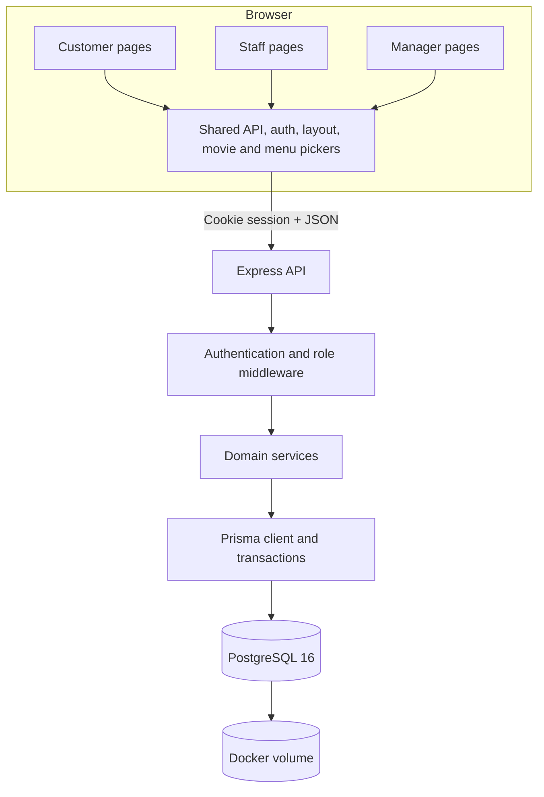
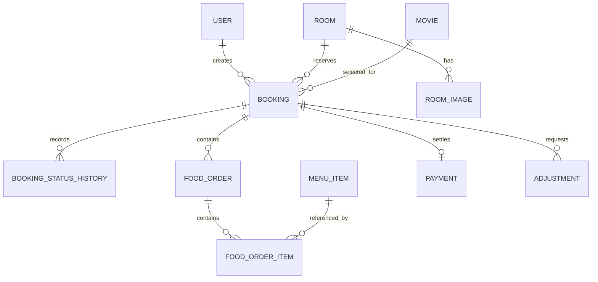
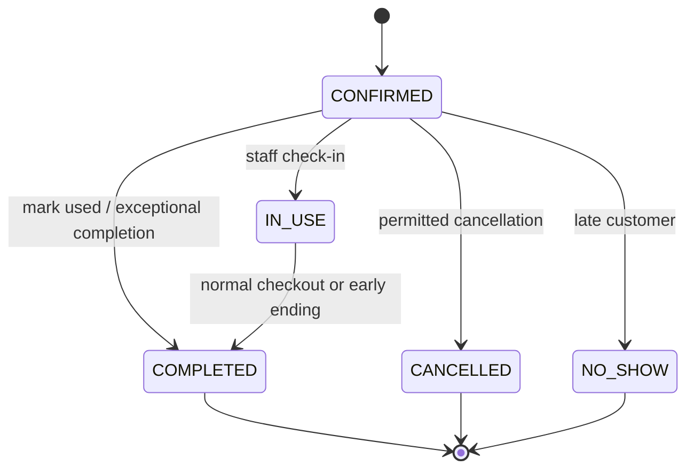

# CineNest Architecture

## System overview

CineNest is a three-role web system for a private movie café. The browser is a Vite multi-page application written in HTML, CSS, and TypeScript. It calls an Express JSON API. Prisma maps application operations to PostgreSQL, while important integrity rules are also enforced directly in SQL.

## Runtime components

### Frontend

- Each screen has an HTML entry point and a TypeScript controller.
- `frontend/shared/api.ts` is the only HTTP client used by pages.
- `frontend/shared/auth.ts` protects role-specific pages.
- `frontend/shared/layout.ts` mounts navigation, status badges, toasts, and shared UI behavior.
- `movie-picker.ts` and `menu-picker.ts` are reusable widgets used by customer and staff booking flows.
- Vite serves the development application and builds all pages into `frontend/dist` for production.

### Backend

- `backend/src/app.ts` configures security headers, CORS, JSON parsing, sessions, logging, routes, static production assets, and error handling.
- Modules are organized by domain: authentication, rooms, bookings, movies, menu, payments, reports, and staff routing.
- Routes validate untrusted input with Zod and delegate business rules to services.
- Services use Prisma transactions and explicit row locks for operations that may race.
- Errors use a consistent envelope and stable business error codes.

### Database

- PostgreSQL runs in Docker for a consistent local database version.
- `schema.prisma` describes models and relations used by the application.
- `prisma/migrations/` contains the SQL that creates and evolves the real database.
- The Docker volume stores live rows. GitHub stores schema, migrations, seed logic, and small sample data, not the live database.

## Main data model

Important tables:

- `user`: identity, password hash, role, and active state.
- `session`: server-side login sessions stored by `connect-pg-simple`.
- `room` and `room_image`: capacity, price, amenities, active state, and display images.
- `movie`: catalogue metadata, runtime, availability, source, and external ID.
- `booking`: room interval, customer snapshot, movie preparation, room price snapshot, booking status, and payment status.
- `booking_status_history`: auditable booking, movie, and payment changes.
- `food_order` and `food_order_item`: service state plus trusted item name and price snapshots.
- `payment`: final collected amount and method.
- `adjustment`: pending, approved, rejected, or withdrawn discounts and waivers.
- `idempotency_request`: request fingerprints and replayed results for critical writes.

## Booking lifecycle

Payment status is separate from booking status:

- `UNPAID`: no completed payment.
- `PAID`: payment was collected and a payment record exists.
- `WAIVED`: an approved full waiver closed the amount without creating a payment record.

This separation allows an operational session to finish before an exception or adjustment is resolved.

## Availability and double-booking protection

Availability uses the half-open interval `[startAt, occupiedUntil)`, where `occupiedUntil` is the session end plus 30 minutes for cleaning. A room is unavailable when an active booking range overlaps this complete interval.

Protection exists at two levels:

1. The booking service locks the room row with `SELECT ... FOR UPDATE`, checks for conflicts, and creates the booking inside one transaction.
2. PostgreSQL uses a GiST exclusion constraint on room and time range. Even if two application requests race, the database permits only one overlapping active booking.

The PF02 scenario sends 200 simultaneous requests for the same room and time. The expected result is one HTTP 201, 199 HTTP 409 responses, and exactly one database row.

## Idempotency

Online booking, walk-in booking, and checkout require an `Idempotency-Key`.

- The first request stores its fingerprint and result.
- Repeating the same key with the same payload returns the original result.
- Reusing the key with a different payload returns 422.
- Failed operations release the key so the caller can retry safely.

This prevents double booking or double collection caused by repeated clicks, client retries, or unstable connections.

## Authentication and authorization

- Passwords are hashed with bcrypt.
- Sessions are stored in PostgreSQL and delivered through an HTTP-only cookie.
- Route middleware checks `CUSTOMER`, `STAFF`, or `MANAGER` access.
- Failed logins are rate limited by identity and network address.
- Deactivating an employee removes that employee's active sessions.
- The frontend redirects authenticated users to the correct role home and rejects unsafe redirect targets.

## Trusted pricing and historical accuracy

The browser never decides authoritative prices. When a booking or food order is created, the backend reloads active room and menu records, calculates the amount, and stores snapshots. Historical invoices remain correct after a manager changes a current catalogue price.

## Movie data

The seed includes a compact catalogue. The importer processes The Movies Dataset/TMDB metadata, filters unsuitable rows, maps genres to English, stores source IDs, and inserts records in batches. Pagination prevents the browser from loading thousands of movies at once.

## Images

- Menu images are committed under `frontend/public/images/menu/` and referenced with safe `/images/menu/...` paths.
- Room image URLs are stored in `room_image` and seeded/migrated for shared development data.
- Production CSP permits same-origin images, data URLs, and HTTPS images.

## Testing boundaries

- Backend integration tests use a dedicated PostgreSQL test database.
- Playwright starts isolated API and web processes and exercises real browser flows.
- Locust measures availability, contention, and the complete customer journey.
- Lighthouse records frontend performance and quality categories.

Development, test, and performance data must never share the same database during a run.
